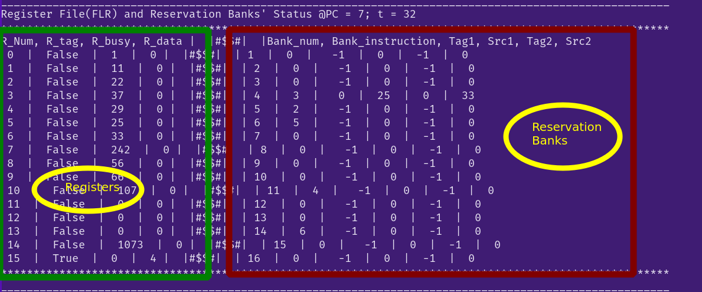
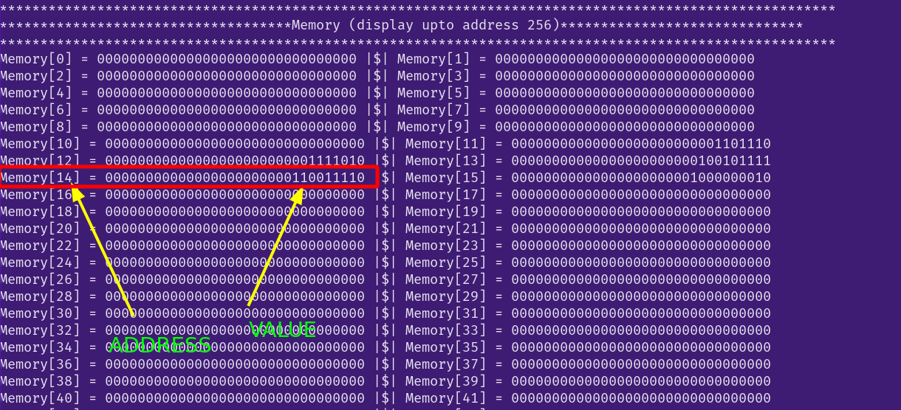

## Dynamic Scheduler using Tomasulo Algorithm
*(implemented using Python3 and Verilog HDL)*

### Table of contents
* [Input Instructions File](#input-instructions-file)
* [How to Execute](#how-to-execute)
* [Outputs](#outputs)
___

### Input Instructions File
#### Instructions Set Architecture
* Total 6 operations supported:
    * FADD D S1 S2
    * FMUL D S1 S2
    * ADD D S1 S2
    * MUL D S1 S2
    * LD D S1             (// D = M[S1]) 
    * ST D S1              (// M[D] = S1)
* D stands for the destination register Rn
* S1 stands for the source1 register Rn
* S2 stands for the source2 register Rn

* Sample File format

    * ***Note**: There should not be any empty line in the file.*

___
### How to Execute
Open the terminal and run
>   python3 main.py
___
### Outputs
* The Registers and Reservation banks status displayed after each clock time `t`

* The Memory status at the end of the program

* Final Report: The status of Arrival times and execution times of each of the insructions

___